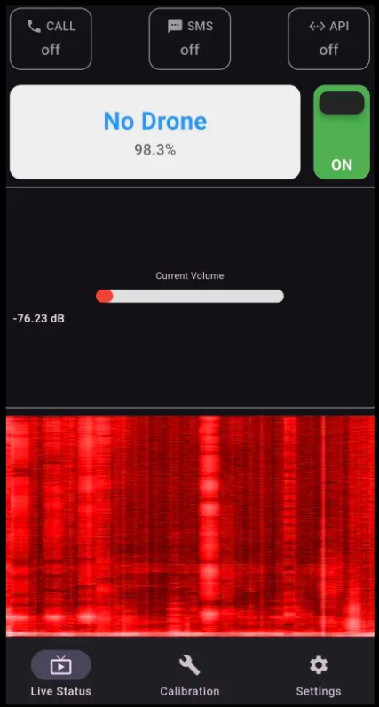

# DroneEAR

## What is it?
DroneEAR is a mobile application written in the Flutter framework. It is designed to detect nearby drone activity through acoustic analysis. The system can trigger configurable alerts such as push notifications, phone calls, SMS messages, or API requests when drone sounds are recognised.

## Machine Learning
I trained a Convolutional Neural Network to identify drone acoustics in different environments such as cities, forests, and open fields. The dataset was constructed by mixing audio from multiple online sources including YouTube, Kaggle, and publicly available drone sound repositories referenced in academic literature, especially those related to drone sound recognition.

## Why?
I started this project as an introduction to my master's thesis as well as an exploration of an idea that became increasingly relevant due to the current military situation in Ukraine and general geopolitical tensions. The broader concept is to create a resilient mesh-network-based system capable of operating independently of existing communication infrastructure. Such a system could propagate drone activity intelligence across a distributed network, providing early situational awareness.

This could be helpful when soldiers wear hearing protection or lack awareness of their surroundings while inside buildings. A device could also function as a mobile, battery-powered acoustic sensor placed in strategic locations as an additional intelligence source.

## How?
The current prototype runs on standard Android devices, which impose limitations on low-level hardware access and antenna control, making true mesh-network communication difficult or infeasible. Workarounds such as automated calls, SMS alerts, or API communication rely on cellular connectivity, which may fail during infrastructure outages (unless combined with satellite communication hardware).

A more robust solution would involve using open hardware platforms such as Arduino, equipped with dedicated antennas and neural processing modules, to build a fully autonomous and resilient drone-detection mesh network.

## Technology
- **Machine Learning:** PyTorch for model development and Tensorboard for visualisation and logging.
- **Audio Processing:** Librosa for spectrogram analysis, preprocessing, and dataset mixing.
- **Mobile App:** Flutter for Android application development. With the assistance of GitHub Copilot, I was able to implement the app within a week despite having little prior experience with the framework.

Flutter app repository: https://github.com/I-WOObin-I/Project-Dronear
Training repository:    https://github.com/I-WOObin-I/Project-Dronear-Training
---

